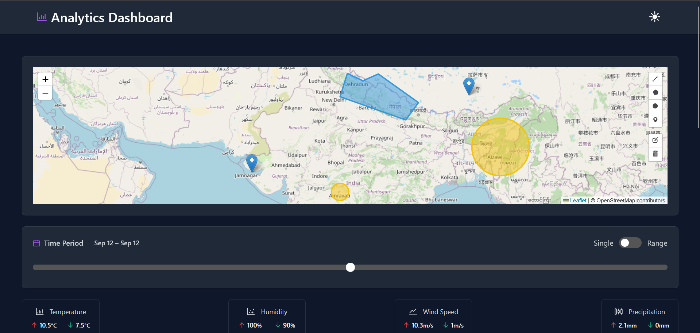

# Weather Dashboard

<div align="center">
  
</div>

<br/>

<div align="center">

  [](https://reactjs.org/)
  [](https://www.typescriptlang.org/)
  [](https://vitejs.dev/)
  [](https://leafletjs.com/)
  [](https://nivo.rocks/)
  [](https://recharts.org/)

</div>


## 🌦️ About The Project

A modern, interactive weather dashboard that provides real-time weather data visualization through interactive maps and detailed metrics. The application enables users to draw custom shapes on the map to analyze weather data for specific geographic areas, featuring an intuitive time slider for exploring historical weather patterns and trends.

## 🌍 Live Demo

Check out the live demo: [Weather Dashboard](https://weather-dashboard.nagarajukasarla.live)

## 📸 Screenshots

<div align="center">
  
  
  
</div>

## 🚀 Features

- **🌍 Interactive Map**
  - Draw custom shapes to define specific geographic areas for weather analysis
  - Pan and zoom to explore different regions with detailed map layers
  - Get precise coordinates and elevation data for any location

- **📊 Advanced Data Visualization**
  - **Line Charts**: Track temperature, humidity, and other metrics over time
  - **Pie Charts**: Visualize weather condition distributions and precipitation types
  - **Bar Graphs**: Compare weather metrics across different time periods

- **🔄 Real-time Data Integration**
  - Live weather updates with configurable refresh intervals
  - Historical weather data analysis with customizable date ranges
  - Animated weather transitions and forecast predictions

- **🎚️ Interactive Controls**
  - Time sliders to explore historical weather patterns
  - Toggle switches for different weather parameters

## 🛠️ Built With

- [React](https://reactjs.org/) - Frontend library
- [TypeScript](https://www.typescriptlang.org/) - Type safety
- [Vite](https://vitejs.dev/) - Build tool and development server
- [Redux](https://redux.js.org/) - State management
- [Ant Design](https://ant.design/) - UI components
- [Tailwind CSS](https://tailwindcss.com/) - Utility-first CSS framework
- [Shadcn UI](https://ui.shadcn.com/) - UI components appearance
- [Leaflet](https://leafletjs.com/) - Interactive maps
- [Recharts](https://recharts.org/) - Data visualization
- [Open-Meteo API](https://open-meteo.com/) - Weather data

## 🚀 Getting Started

1. Clone the repository:
   ```bash
   git clone https://github.com/Nagarajukasarla/weather-dashboard.git
   cd weather-dashboard
   ```

2. Install dependencies:
   ```bash
   bun install
   # or
   npm install
   ```

3. Start the development server:
   ```bash
   bun dev
   # or
   npm run dev
   ```

4. Open [http://localhost:5173](http://localhost:5173) in your browser.
## 📝 License

Distributed under the MIT License. See `LICENSE` for more information.
